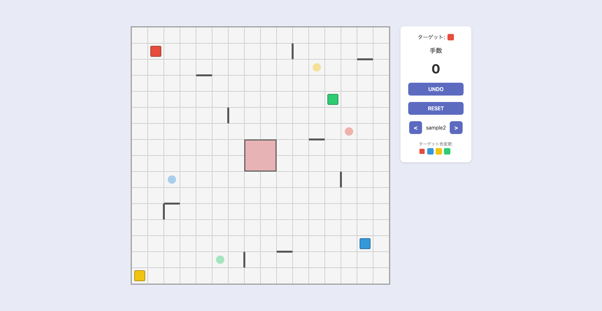

# Hyper Robot



16x16 グリッド上で 4 色のロボットを動かすパズルゲーム「ハイパーロボット」の Web アプリケーションです。

## ルール

- 盤上には赤・青・黄・緑の 4 体のロボットが配置されています
- ロボットは選択した方向に、壁または他のロボットに当たるまで直進します
- 指定された色のロボットを、対応する色のチップの位置まで移動させればクリアです
- できるだけ少ない手数でのクリアを目指しましょう

## 技術スタック

- TypeScript / React / Vite

## セットアップ

```bash
npm install
npm run dev
```

## ライセンス

MIT
